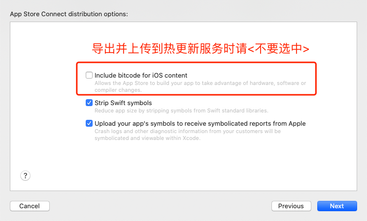

#### 优化原生和热更包体积

##### iOS 原生包优化(ipa)

在导出 ipa 以便上传到 pushy 服务时，可以取消 bitcode 选项以大幅减小 ipa 大小。上架 app store 或者通过 testflight 分发测试包时仍然可以保留 bitcode 选项，不影响热更新。



##### Android 原生包优化(apk)

apk 的优化主要考虑两个方向：

- [启用 proguard 压缩混淆源码](https://reactnative.cn/docs/signed-apk-android#%E5%90%AF%E7%94%A8proguard%E6%9D%A5%E5%87%8F%E5%B0%91apk%E7%9A%84%E5%A4%A7%E5%B0%8F%EF%BC%88%E5%8F%AF%E9%80%89%EF%BC%89)。但这一步可能导致一些使用反射的代码运行时报错，启用后需要充分测试每个页面和功能，以及需要阅读一些第三方关于 proguard 的特别设置说明。
- [删除一些不会用到的 cpu 架构支持](https://reactnative.cn/docs/signed-apk-android#%E9%92%88%E5%AF%B9%E4%B8%8D%E5%90%8C%E7%9A%84-cpu-%E6%9E%B6%E6%9E%84%E7%94%9F%E6%88%90-apk-%E4%BB%A5%E5%87%8F%E5%B0%8F-apk-%E6%96%87%E4%BB%B6%E7%9A%84%E5%A4%A7%E5%B0%8F)。找到`android/app/build.gradle`中的 cpu 架构部分，可以删除`armeabi-v7a`（老的 32 位手机 cpu，现在应该没有这样的设备了）和`x86_64`（64 位的 pc 模拟器，实际几乎无人使用，且`x86`仍然可以在 64 位上正常运行）：

```diff
splits {
    abi {
        reset()
        enable enableSeparateBuildPerCPUArchitecture
        universalApk false  // If true, also generate a universal APK
-       include "armeabi-v7a", "x86", "arm64-v8a", "x86_64"
+       include "x86", "arm64-v8a"
    }
}
```

这样既可以保证兼容模拟器和真机，也大幅减小了 apk 的大小。

##### 热更新包优化(ppk)

热更新包的主要内容是 js 包和一些静态资源（主要是图片）。

- js 包成分分析。可以借助一些第三方工具（如[react-native-bundle-visualizer](https://github.com/IjzerenHein/react-native-bundle-visualizer)）来分析 js 文件中哪些占比较大，是否可以用其他库替换等（如 dayjs 替换 moment，lodash-es 替换 lodash）。
- 图片优化。
  - 在保证体验的情况下，使用一些工具对图片进行裁剪压缩。
  - 如不需要图片的透明像素，可以考虑将 png 格式转为 jpg 格式。
  - 还可以进一步考虑压缩比更高的图片格式，例如 webp 格式（需要第三方原生插件例如[react-native-webp-format](https://github.com/Aleksefo/react-native-webp-format#readme)），heif 格式（iOS 11 和 Android 10 以上原生支持）等。这里有个图片格式对比可供参考 <https://compare.rokka.io/_compare/#heif=40&jpeg=80&webp=80&av1=40&width=800>。

#### 有很多渠道包需要热更，如何操作比较方便？

1. 如果渠道包的`js代码和初始资源`有差别（无论多么细微的差别），那么只能单独生成 apk，分别上传和绑定。可以考虑写一些脚本自动调用 cli 来执行批量操作。
2. 如果渠道包的`js代码和初始资源`完全一致，可以考虑使用一些动态生成渠道包的方案（比如[美团的 walle](https://github.com/Meituan-Dianping/walle)），所有的渠道包基于同一个基础 apk 生成。这样可以只用上传一个基础 apk，对此 apk 的热更操作可以对所有渠道包生效。

#### CI 的集成

在开发环境中，每次 bundle 都会生成一个不同名字的 ppk 文件，这不利于持续集成(CI)系统的引入。

要解决这个问题,你可以使用`--output`参数来指定输出 ppk 文件的名字和路径，便于进行自动发布。

#### 版本测试与发布

我们强烈建议您先发布一个测试包，再发布一个除了版本号以外均完全相同的发布包。在每次往发布包发起热更新之前，先往对应的测试包进行更新操作，基本测试通过之后，可以将发布包更新到完全相同的热更新版本之上。如果在测试包中发现了重大问题，你就可以先进行修复，再次更新测试通过后，再将发布包更新至修复后的版本。这样，可以最大程度的避免用户通过热更新获得一个有问题的版本。

#### 元信息(Meta Info)的使用

在发布热更新版本时，或者在网页端，你可以编辑版本的元信息。这是一段在检查更新时可以获得的字符串，你可以在其中按你所想的格式保存一些信息。

举例来说，可能某个版本包含一些重要的更新内容，所以用户会得到一个不同样式的通知。如何使用元信息，完全取决于您的想象力！

下面会列举一些实战中更有意义的元信息的使用。

#### Hot-fix

有时候我们不小心发布了一个有严重问题的版本，所以需要进行一个紧急的修复，此时我们可能希望之前已经更新到有问题版本的用户进行紧急甚至静默进行更新。

这时候,我们可以在元信息中包含有问题的版本的列表，而在客户端检查更新时，将从元信息里取到的列表与当前版本(currentVersion)比对，如果匹配成功，我们就进行静默更新，否则则按照一般的更新流程提示用户。
