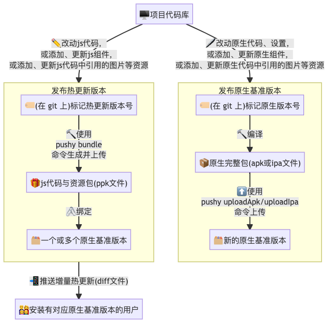

现在你的应用已经具备了检测更新的功能，下面我们来尝试发布并更新它。流程可参考下图：



一般来说我们需要先发布原生基准版本，然后在基准版本之上迭代业务逻辑，发布热更新版本。如果迭代过程中有原生方面的修改，则需要发布新的基准版本。可以只保留一个原生基准版本，也可以多版本同时维护。

## 发布原生基准版本

### iOS

首先参考[文档-在设备上运行](https://reactnative.cn/docs/running-on-device)，确定你正在使用离线包。然后点击菜单。

按照正常的发布流程打包`.ipa`文件：

1. Xcode 中运行设备选真机或 Generic iOS Device
2. 菜单中选择 Product - Archive
3. Archive 完成后选择`Export`生成.ipa 文件，此时建议取消 bitcode 选项以减少 ipa 大小
4. 然后运行如下命令上传到 pushy 服务器以供后续版本比对之用

```bash
$ pushy uploadIpa <ipa后缀文件>
```

此 ipa 的`CFBundleShortVersionString`字段(位于`ios/项目名/Info.plist`中)会被记录为原生版本号`packageVersion`。

随后你可以选择往 AppStore 上传这个版本（注意是刚刚已经 archive 完成的包重新选择 Upload 选项，且此时应该勾选 bitcode 选项），也可以先通过[Test flight](https://developer.apple.com/cn/testflight/)或[蒲公英](https://www.pgyer.com/doc/view/build_ipa)等渠道进行真机安装测试。请注意：暂不支持通过 Xcode 直接进行热更新测试。

如果后续需要再次打包（例如修改原生代码或配置），请先**更改版本号**，并再次`uploadIpa`到服务器端记录，否则后续生成的相同版本的原生包会由于[编译时间戳不一致而`无法获取热更新`](faq.html#热更新报错：热更新已暂停，原因：buildtime-mismatch。)。

> 注意：如果你在上传之前就运行了新的原生版本，由于服务器端没有记录，会暂停其更新数小时。可在删除原先安装的 app 再重新安装以清空暂停设置。在上传之后安装的客户端不会受此影响。

### Android

首先参考[文档-打包 APK](https://reactnative.cn/docs/signed-apk-android)设置签名，然后在 android 文件夹下运行`./gradlew assembleRelease`或`./gradlew aR`，你就可以在`android/app/build/outputs/apk/release/app-release.apk`中找到你的应用包。

> 如果你需要使用 aab 格式（android app bundle，google 市场专用）的包，请参考这里的[做法](bestpractice.html#如何支持-aab-格式的原生包？)将其转换为 apk 格式后再操作。

然后运行如下命令

```bash
$ pushy uploadApk android/app/build/outputs/apk/release/app-release.apk
```

即可上传 apk 以供后续版本比对之用。此 apk 的`versionName`字段(位于`android/app/build.gralde`中)会被记录为原生版本号`packageVersion`。

随后你可以选择往应用市场发布这个版本，也可以先往设备上直接安装这个 apk 文件以进行测试。

如果后续需要再次打包（例如修改原生代码或配置），请先**更改版本号**，并再次`uploadApk`到服务器端记录，否则后续生成的相同版本的原生包会由于[编译时间戳不一致而`无法获取热更新`](faq.html#热更新报错：热更新已暂停，原因：buildtime-mismatch。)。

> 注意：如果你在上传之前就运行了新的原生版本，由于服务器端没有记录，会暂停其更新数小时。可删除原先安装的 app 再重新安装以清空暂停设置。在上传之后安装的客户端不会受此影响。

## 发布热更新版本

你可以尝试修改一行代码(譬如将版本一修改为版本二)，然后使用`pushy bundle --platform <ios|android>`命令来生成新的热更新版本。

```bash
$ pushy bundle --platform android
Bundling with React Native version:  0.22.2
<各种进度输出>
Bundled saved to: build/output/android.1459850548545.ppk
Would you like to publish it?(Y/N)
```

如果想要立即上传，此时输入 Y。当然，你也可以在将来使用`pushy publish --platform android build/output/android.1459850548545.ppk`来上传刚才打包好的热更新包。

```
  Uploading [========================================================] 100% 0.0s
Enter version name: <输入热更新版本名字，如1.0.0-rc>
Enter description: <输入热更新版本描述>
Enter meta info: {"ok":1}
Ok.
Would you like to bind packages to this version?(Y/N)
```

此时版本已经提交到 pushy 服务，但用户暂时看不到此更新，你需要先将特定的原生包版本绑定到此热更新版本上。

此时输入 Y 立即绑定，你也可以在将来使用`pushy update --platform <ios|android>`来对已上传的热更包和原生包进行绑定。除此以外，你还可以在网页端操作，简单的将对应的原生包版本拖到需要的热更新版本下即可。

```
Offset 0
1) FvXnROJ1 1.0.1 (no package)
2) FiWYm9lB 1.0 [1.0]
Enter versionId or page Up/page Down/Begin(U/D/B) <输入序号,U/D翻页,B回到开始，序号就是上面列表中)前面的数字>

1) 1.0(normal) - 3 FiWYm9lB (未命名)

Total 1 packages.
Enter packageId: <输入原生包版本序号，序号就是上面列表中)前面的数字>
```

版本绑定完毕后，服务器会在几秒内生成差量补丁，客户端就可以获取到更新了。

后续要继续发布新的热更新，只需反复执行`pushy bundle`命令即可。

恭喜你，至此为止，你已经完成了植入代码热更新的全部工作。
