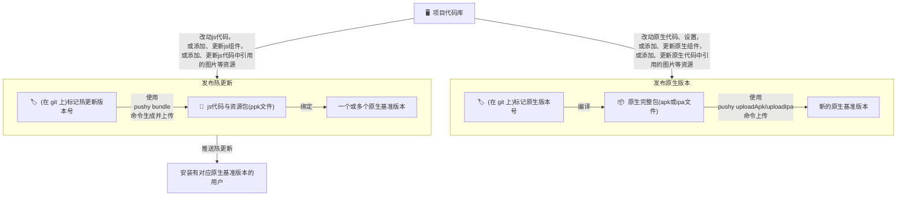

```mermaid
flowchart TD
    codebase["🖥️&nbsp;&nbsp;项目代码库"]
    subgraph 发布原生版本
    tagNativeVersion["🏷️&nbsp;&nbsp;(在 git 上)标记原生版本号"]
    newNativeVersion[新的原生基准版本]
    nativePackage["📦&nbsp;&nbsp;原生完整包(apk或ipa文件)"]
    tagNativeVersion--"编译"-->nativePackage
    nativePackage--"使用<br/>pushy uploadApk/uploadIpa<br/>命令上传"-->newNativeVersion
    end
    subgraph 发布热更新
    tagBundleVersion["🏷️&nbsp;&nbsp;(在 git 上)标记热更新版本号"]
    bundlePackage["🎁&nbsp;&nbsp;js代码与资源包(ppk文件)"]
    tagBundleVersion--"使用<br/>pushy bundle<br/>命令生成并上传"-->bundlePackage
    bundlePackage--"绑定"-->一个或多个原生基准版本
    end
    codebase--"改动js代码，<br/>或添加、更新js组件，<br/>或添加、更新js代码中引用的图片等资源"-->发布热更新
    codebase--"改动原生代码、设置，<br/>或添加、更新原生组件，<br/>或添加、更新原生代码中引用的图片等资源"-->发布原生版本
    发布热更新--"推送热更新"-->安装有对应原生基准版本的用户
```
