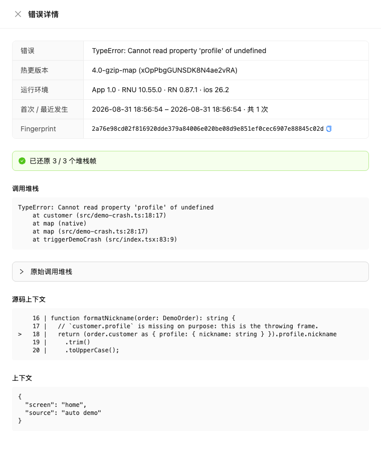

热更新最怕的场景是：版本已经推给用户了，某个页面在特定机型上白屏，而你手里只有一句「用户说打不开」。

自 `react-native-update` v10.55.0 起，SDK 会把热更版本里发生的 JavaScript 异常上报给更新服务，管理后台按「应用 + 热更版本 + 指纹」聚合展示，并**用发布时归档的 sourcemap 把压缩后的堆栈还原回原始源码位置**——包括出错那一行前后的代码。定位一个线上报错，通常不需要再去复现。

## 效果

在管理后台的[版本健康度](https://pushy-admin.reactnative.cn/#/version-health)页面选择应用，页面底部即是「JavaScript 报错」列表，点击任意一条打开详情：



详情里包含：

- **调用堆栈**：已还原到 `src/demo-crash.ts:18:17` 这样的原始位置与函数名，右上角标注还原了多少帧（`已还原 3 / 3 个堆栈帧`）
- **源码上下文**：首个可还原帧前后各两行源码，`>` 标出出错行
- **原始调用堆栈**：折叠保留 Hermes 字节码偏移的原始文本，便于交叉验证
- **运行环境**：原生包版本、SDK / React Native / 系统版本
- **上下文**：你在 `captureException` 里附带的自定义字段（见下文）

列表支持按「未捕获 / 已捕获」筛选，同一个报错会按指纹聚合并累加次数，只保留一份代表性堆栈。

## 需要做什么

**基本不需要做什么。** 上报默认开启，符号化所需的 sourcemap 由 CLI 在发布时自动归档：

1. 客户端使用 `react-native-update` **v10.55.0 及以上**；
2. 发布使用 `react-native-update-cli` **v2.24.2 及以上**（`pushy bundle` 会自动生成并归档对应版本的 sourcemap）。

sourcemap 只保存在服务端用于还原堆栈，**不会下发给客户端**，也不占用套餐的热更包体积额度；上传前 CLI 会自动剥离 `node_modules` 的内联源码并压缩，实际归档体积通常只有原始 sourcemap 的十分之一。

:::warning
只有**运行在热更版本上**的报错会被上报。应用运行在原生包自带的基线 bundle（还没应用任何热更）时不会上报——那部分崩溃属于原生包的范畴，请使用 Sentry、Firebase Crashlytics 等常规崩溃监控。
:::

## 上报了什么

- **未捕获异常**：SDK 会在 React Native 现有的全局 `ErrorUtils` 处理器之上**追加**一层（不会替换或吞掉），因此 Sentry、Crashlytics 等已有集成不受影响，红屏与原有上报链路照常
- **手动上报**：业务代码在 `catch` 里主动调用 `client.captureException(error, { extra })`

上报内容为错误名、错误信息、堆栈、可选的 React 组件堆栈与自定义 `extra` 字段，加上当前热更版本 hash、原生版本号与 `cInfo`（与 checkUpdate 请求一致的 SDK / RN / 系统版本信息）。各字段都有长度上限（如堆栈 32KB），超出部分截断。上报是一次性异步请求，不重试、失败静默，同一个错误对象只会上报一次；调试环境（`__DEV__`）下不上报。

报错数据保留 31 天。

## 手动上报

```ts
import { Pushy } from "react-native-update";

const pushyClient = new Pushy({ appKey });

try {
  await submitOrder(order);
} catch (e) {
  pushyClient.captureException(e, {
    // 是否标记为致命错误，默认 false
    fatal: false,
    // 自定义上下文，会原样显示在后台的「上下文」区块
    extra: { screen: "checkout", orderId: order.id },
  });
  showRetryToast();
}
```

在组件里可以直接从 `useUpdate()` 取到 `client`：

```tsx
const { client } = useUpdate();

<ErrorBoundary
  onError={(error, info) =>
    client?.captureException(error, {
      fatal: true,
      componentStack: info.componentStack,
    })
  }
/>;
```

`extra` 只接受字符串、数字、布尔与 null，最多 32 个字段，请不要放入用户隐私数据。

## 关闭上报

```js
const pushyClient = new Pushy({
  appKey,
  disableErrorReporting: true,
});
```

关闭后管理后台将不再收到该客户端的 JS 报错。它与[版本健康度事件上报](api#版本健康度事件上报)的开关 `disableTelemetry` 相互独立：关闭 `disableTelemetry` 会同时停掉两者，只关 `disableErrorReporting` 则仅停掉 JS 报错。

## 常见情况

**详情里提示「该热更版本没有归档 sourcemap」**：该版本发布时没有归档 sourcemap（CLI 版本过旧，或使用了自定义打包流程后用 `pushy publish` 手动发布却没有带 `--sourcemap <路径>`）。此时仍会展示原始堆栈，重新发布一个带 sourcemap 的版本后，后续报错即可还原。

**详情里提示「sourcemap 符号化失败」**：归档文件暂时下载不到或已损坏，展示原始堆栈；稍后重试即可。

**报错列表是空的**：确认应用运行在热更版本上（基线 bundle 不上报），且客户端 SDK 不低于 v10.55.0；报错数据保留 31 天，更早的记录会被清理。

**还原后的帧数少于总帧数**：属于正常现象。`at map (native)` 这类引擎内部帧本身没有对应源码位置；若业务帧大量无法还原，通常说明归档的 sourcemap 与实际下发的 bundle 不是同一次构建产物。
