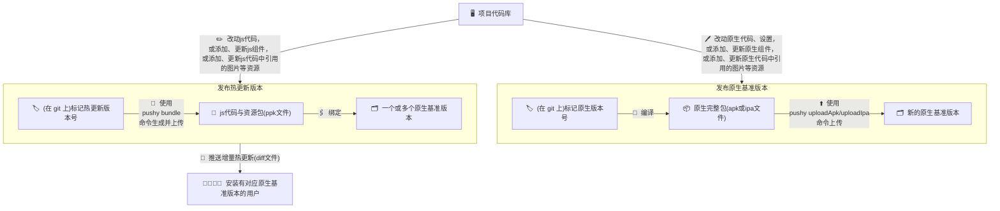

import { Callout } from "nextra/components";

现在你的应用已经具备了检测更新的功能，下面我们来尝试发布并更新它。流程可参考下图：



流程总结如下：

1.  我们需要先打包一个原生 release 版本，在打包前请确保已集成了`react-native-update`并在调试过程中运行正常，安卓端[关闭了`crunchPngs`设置](/docs/getting-started#%E7%A6%81%E7%94%A8-android-%E7%9A%84-crunch-%E4%BC%98%E5%8C%96)，打包说明可参考[iOS 打包](https://reactnative.cn/docs/publishing-to-app-store)和[android 打包](https://reactnative.cn/docs/signed-apk-android)。打包完成后请使用`pushy uploadIpa`或者`pushy uploadApk`命令来把这个安装包上传到 pushy 服务器端，以作为之后热更差量对比的基准。同时请保留好这个安装包，上架和分发给用户所使用的安装包`需要和服务器端完全一致`。建议使用 git tag 功能来标记原生版本号（例如`v1.0.0`）。
2.  然后在基准版本之上迭代业务逻辑（增删 js 代码，增删图片等静态资源），使用`pushy bundle`命令来生成和发布热更新版本，而不需要重新打包。建议使用 git tag 功能来标记热更版本号（例如`v1.0.1`）。
3.  如果迭代过程中有原生方面的修改，则需要发布并上传新的原生基准版本（重复步骤 1，但需要设置不同的原生版本号）。可以只保留一个原生基准版本，也可以多版本同时维护。

## 发布原生基准版本

### iOS

首先参考[文档-在设备上运行](https://reactnative.cn/docs/running-on-device)，确定你正在使用离线包。然后点击菜单。

按照正常的发布流程打包`.ipa`文件：

1. Xcode 中运行设备选真机或 Generic iOS Device
2. 菜单中选择 Product - Archive
3. Archive 完成后选择`Export`生成.ipa 文件
4. 然后运行如下命令上传到 pushy 服务器以供后续版本比对之用

```bash
$ pushy uploadIpa <ipa后缀文件>
```

此 ipa 的`CFBundleShortVersionString`字段(位于`ios/项目名/Info.plist`中)会被记录为原生版本号`packageVersion`。

随后你可以选择往 AppStore 上传这个版本（可以重新 export 并调整相关选项，但请不要重新 archive），也可以先通过[Test flight](https://developer.apple.com/cn/testflight/)或[蒲公英](https://www.pgyer.com/doc/view/build_ipa)等渠道进行真机安装测试。请注意：暂不支持通过 Xcode 直接进行热更新测试。

如果后续需要再次 archive 打包（例如修改原生代码或配置。如果只是修改 js 代码则不需要重新打包。），请先**更改版本号**，并在打包完成后再次`uploadIpa`到服务器端记录，否则后续生成的相同版本的原生包会由于[编译时间戳不一致而`无法获取热更新`](faq#热更新报错：热更新已暂停，原因：buildtime-mismatch。)。

### Android

首先参考[文档-打包 APK](https://reactnative.cn/docs/signed-apk-android)设置签名，然后在 android 文件夹下运行`./gradlew assembleRelease`或`./gradlew aR`，你就可以在`android/app/build/outputs/apk/release/app-release.apk`中找到你的应用包。

> 如果你需要使用 aab 格式（android app bundle，google 市场专用）的包，请参考这里的[做法](bestpractice#如何支持-aab-格式的原生包)将其转换为 apk 格式后再操作。

然后运行如下命令

```bash
$ pushy uploadApk android/app/build/outputs/apk/release/app-release.apk
```

即可上传 apk 以供后续版本比对之用。此 apk 的`versionName`字段(位于`android/app/build.gradle`中)会被记录为原生版本号`packageVersion`。

随后你可以选择往应用市场发布这个版本，也可以先往设备上直接安装这个 apk 文件以进行测试。

如果后续需要再次打包（例如修改原生代码或配置。如果只是修改 js 代码则不需要重新打包。），请先**更改版本号**，并再次`uploadApk`到服务器端记录，否则后续生成的相同版本的原生包会由于[编译时间戳不一致而`无法获取热更新`](faq#热更新报错：热更新已暂停，原因：buildtime-mismatch。)。

### Harmony

首先下载鸿蒙开发IDE DevEco-Studio，然后通过Build => Build Hap(s)/App(s) => Build App(s)，你就可以在`harmony/build/outputs/default/harmony-default-unsigned.app`中找到你的应用包。

然后运行如下命令

```bash
$ pushy uploadApp harmony/build/outputs/default/harmony-default-unsigned.app
```

即可上传 app 以供后续版本比对之用。此 app 的`versionName`字段(位于`harmony/AppScope/app.json5`中)会被记录为原生版本号`packageVersion`。

随后你可以选择往华为应用市场发布这个版本，也可以先往设备上通过命令`hdc shell`命令安装这个 app 文件以进行测试。

如果后续需要再次打包（例如修改原生代码或配置。如果只是修改 js 代码则不需要重新打包。），请先**更改版本号**，并再次`uploadApp`到服务器端记录，否则后续生成的相同版本的原生包会由于[编译时间戳不一致而`无法获取热更新`](faq#热更新报错：热更新已暂停，原因：buildtime-mismatch。)。

## 发布热更新版本

你可以尝试修改一行代码(譬如将版本一修改为版本二)，然后使用`pushy bundle --platform <ios|android|harmony>`命令来生成新的热更新版本。

<Callout type="info">
  如果你使用了较新版本的`expo`或其他没有`index.js`的框架，执行`bundle`命令时会报错。此时请手动创建一个`index.js`文件，在其中引用框架自身的入口文件即可。具体入口文件的路径如何，请参考框架的说明文档或者`package.json`中的`main`字段。例如针对`expo`的`index.js`可能是如下这样写：

```js
import "expo-router/entry";
```

</Callout>

```bash
$ pushy bundle --platform android
Bundling with React Native version:  0.22.2
<各种进度输出>
Bundled saved to: build/output/android.1459850548545.ppk
Would you like to publish it?(Y/N)
```

如果想要立即上传，此时输入 Y。当然，你也可以在将来使用`pushy publish --platform android build/output/android.1459850548545.ppk`来上传刚才打包好的热更新包。

```
  Uploading [========================================================] 100% 0.0s
Enter version name: <输入热更新版本名字，如1.0.0-rc>
Enter description: <输入热更新版本描述>
Enter meta info: {"ok":1}
Ok.
Would you like to bind packages to this version?(Y/N)
```

此时版本已经提交到 pushy 服务，但用户暂时看不到此更新，你需要先将特定的原生包版本绑定到此热更新版本上。

此时输入 Y 立即绑定，你也可以在将来使用`pushy update --platform <ios|android|harmony>`来对已上传的热更包和原生包进行绑定。除此以外，你还可以在网页端操作，简单的将对应的原生包版本拖到需要的热更新版本下即可。

```
┌────────────┬──────────────────────────────────────┐
│ Package Id │               Version                │
├────────────┼──────────────────────────────────────┤
│   46272    │ 2.0(normal)                          │
├────────────┼──────────────────────────────────────┤
│   45577    │ 1.0(normal)                          │
└────────────┴──────────────────────────────────────┘
共 2 个包
输入原生包 id: 46272
```

版本绑定完毕后，服务器会在几秒内生成差量补丁，客户端就可以获取到更新了。

后续要继续发布新的热更新，只需反复执行`pushy bundle`命令即可，不需要重新打包。

恭喜你，至此为止，你已经完成了植入代码热更新的全部工作。

## 测试与回滚

请参考最佳实践中的[测试与回滚](bestpractice#测试与回滚)章节。